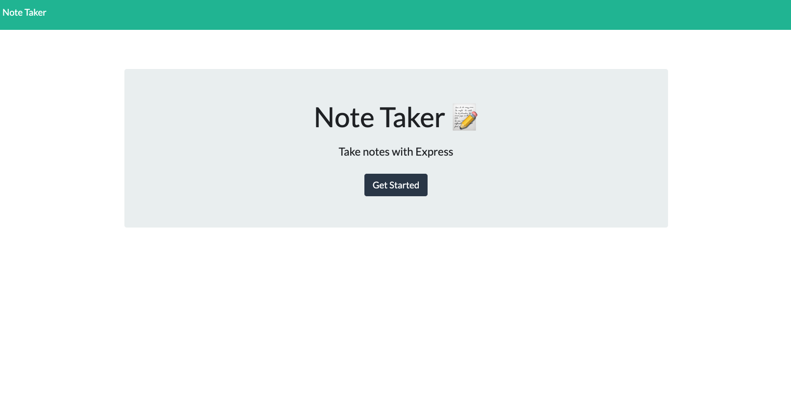

# Note Taker

## Summary
This note taking application allows users to save notes with a title and plain text. Made with ExpressJS, the Note Taker app can create, save and delete notes with no issues.

## Prerequisites
* [NodeJS](https://nodejs.org/)

## Installing

Clone the repository to your local development environment.

Run `npm install` to install all dependencies. To use the application locally, run `node server.js` in your CLI, and then open `http://localhost:3001` in your browser. The Note Taker app is [live on Heroku](https://dry-lake-21011.herokuapp.com/) for you to use as well.

## Preview:

## Deployed Link:
https://dry-lake-21011.herokuapp.com/

## Built With
* [JavaScript](https://developer.mozilla.org/en-US/docs/Web/JavaScript)
* [NodeJS](https://nodejs.org/)
* Node Packages:
    * [Express](https://www.npmjs.com/package/express)

## Authors
Ethan Fregien
* [GitHub](https://github.com/ethanfregien2233)

## License
This project is licensed under the ISC License.